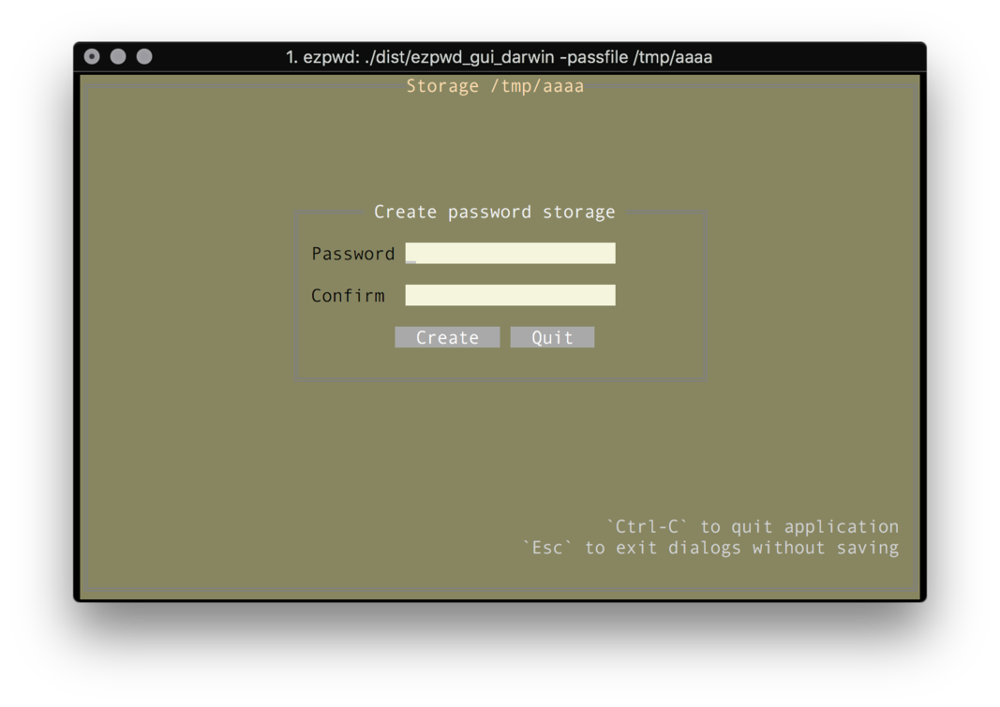
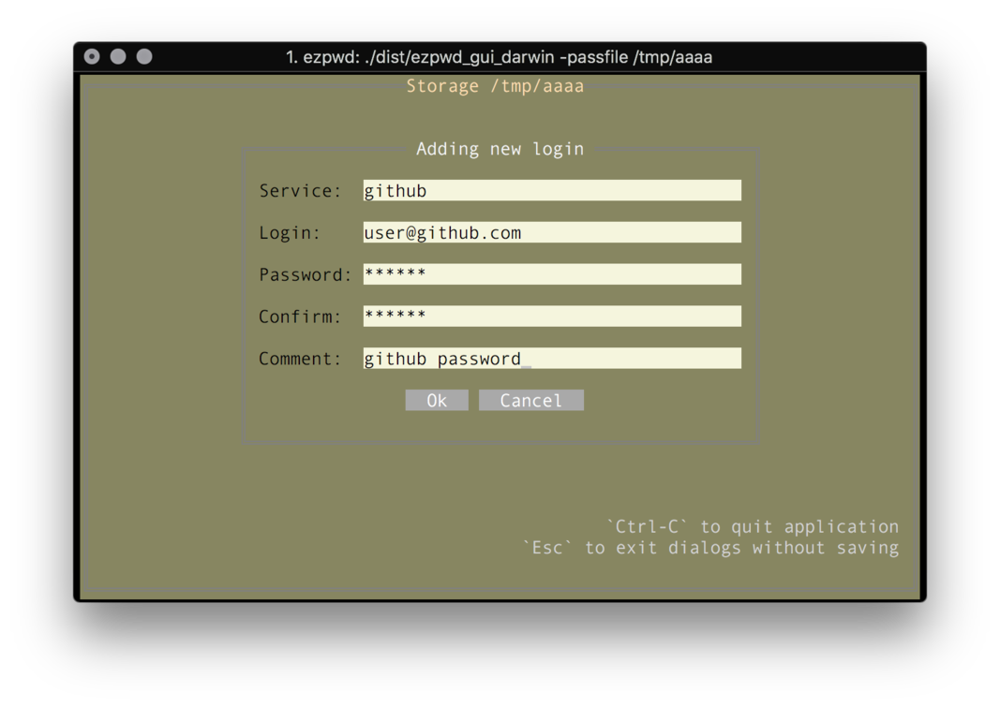
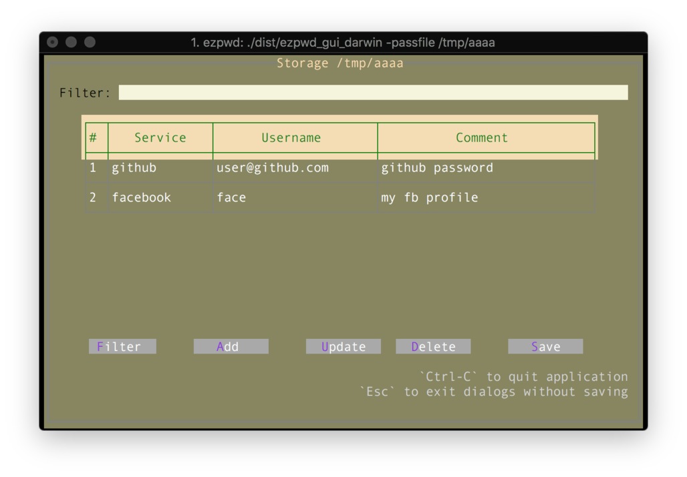
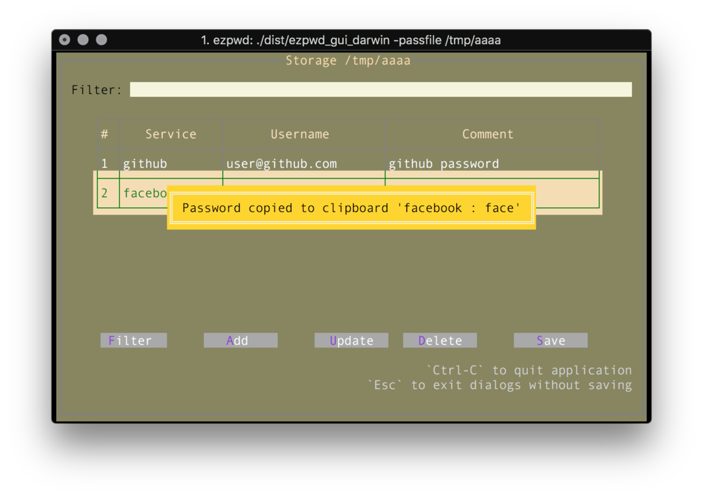
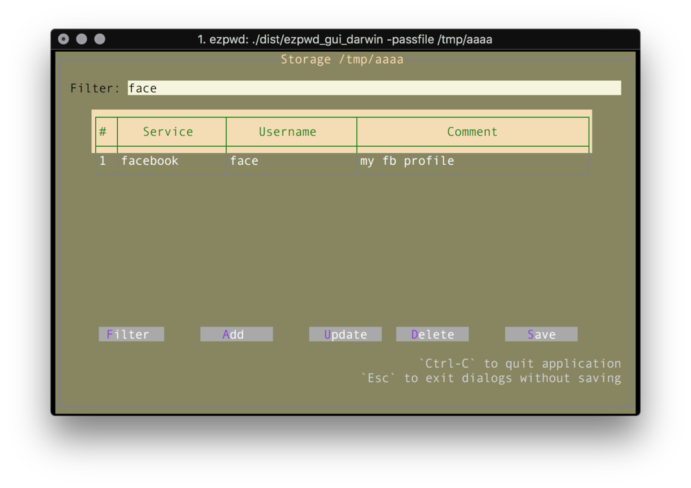

# Rich console interface

Back in the days of [Turbo Vision](https://en.wikipedia.org/wiki/Turbo_Vision) people created pretty neat and functional interfaces using just ASCII character set.
The idea of drawing controls like windows, buttons and text boxes was one of the reasons why Borland was so renown once.

And while this is definitely an old-school way of presenting the application to the end users - it is not obsolete by any means.

So kudos to [TView](https://github.com/rivo/tview/) - the awesome library to create rich text interfaces!

So `ezpwd_tui` - the text-based version of `ezpwd`. 

## Options
```
ezpwd_tui -h
Usage of ezpwd_tui:
  -dump-schema
        Print current schema and exit
  -passfile string
        Password file (default "private/test-pass.enc")
  -schema string
        Color schema file
```

In the same way as for `ezpwd` - `-passfile` defines the location of the encrypted password file.

### Create a new storage

When the password file doesn't exist - `ezpwd_tui` will create one either in `$HOME/private/test-pass.enc`

You will need to specify the password to encrypt / unlock the storage.



### Passwords management

Once the password storage is created - the empty table will be populated.


This page is the main control panel for the entire application. The row of the buttons at the bottom defines actions. These actions are accessible by the first letter ( highlighted one ).

To create the new password, press 'a' - that will open `Add password` dialog:



Once the password is added, it will be listed on the page.



The navigation is performed by pressing `Up` and `Down` keys. To copy the selected password - press `Enter`.



By pressing `d` - `ezpwd_tui` will prompt for removal confirmation, and then remove passwords.

`s` will save the password file. And it will also create the backup in the same folder, so if you made a mistake - you will have backups for you!

With `u` you can update the selected password.


And we all know that the list of the passwords could be quite long, hence it is possible to filter the list of passwords and only show the ones that match the filter. The filter is quite simple - it just filters the content of `login` or `comment` or `service` fields.



## Colors

The good thing is that the color schema could be updated. The built-in schema could be exported as `ezpwd_tui -dump-schema`. This will print out the JSON:
```
{
  "LoginFormColors": {
    "Background": "#87875f",
    "Title": "#f5f5f5",
    "Border": "#808080",
    "Label": "#000000",
    "ButtonBackground": "#a9a9a9",
    "ButtonText": "#ffffff",
    "FieldBackground": "#f5f5dc",
    "FieldText": "#000000"
  },
....
}
```
This file can be saved and modified. For testing use `ezpwd_tui -schema path/to/schema.json`
